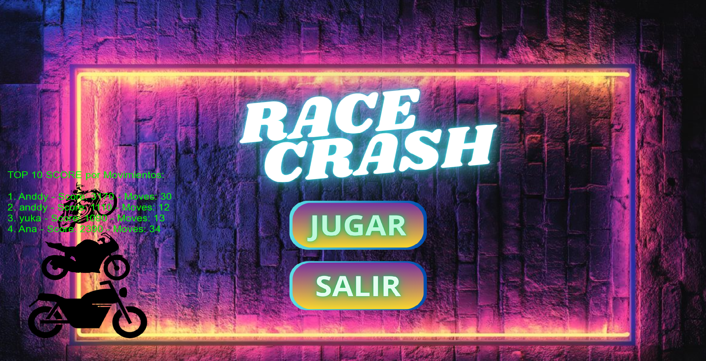
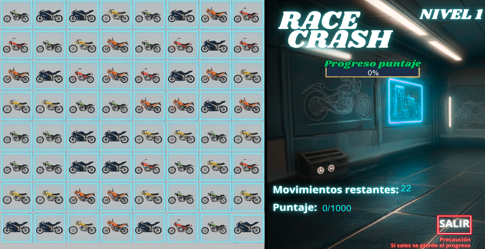

# proyectAnddyZunniga
I entrega

## **RaceCrash**

**RaceCrash** es un juego 2D desarrollado en **C++** con la librería **SFML**, donde el jugador debe combinar las motocicletas por estilo en match de 3 o mas para obtener puntos, romper hielo y activar bombas en diferentes niveles. El diseño de las motocicletas puede confundirte, así que hay que prestar mucha atención para hacer los match que te den un mayor puntaje.

El objetivo es alcanzar el puntaje meta antes de quedarse sin movimientos. Al finalizar el último nivel, el juego guarda el puntaje total y los movimientos en un archivo de ranking, puedes intentar superar tu record anterior, el ranking del menu principal mostrara las 10 partidas que se completaron, el top mostrara el mayor puntaje con menor cantidad de movimientos.

## **Tecnologías utilizadas**

- **Lenguaje:** C++
- **Librería gráfica:** SFML 2.6  
- **Entorno:** Visual Studio 2022  
- **Sistema operativo objetivo:** Windows (x64)

## **Instalación y ejecución**
1.Descarga la versión compilada desde la carpeta `Release/` o el archivo `.zip` disponible.

2.Asegúrate de tener instalado el [Microsoft Visual C++ Redistributable](https://aka.ms/vs/17/release/vc_redist.x64.exe).

3.Extrae la carpeta **RaceCrash**.

4. Ejecuta **hello.exe** para jugar 🎮.

## **Capturas de pantalla**



**Descubre el nivel 2 y 3 instalandolo**


## Diagrama de Clases

```mermaid
classDiagram
    %% ==== CLASE PRINCIPAL ====
    class Juego {
        - currentLevel: int
        - progress: float
        - selected: bool
        - waitingForEnter: bool
        - firstSelect: Vector2i
        - window: RenderWindow
        - tablero: Tablero
        - clock: Clock
        - font: Font
        - scoreText: Text
        - finalScore: Text
        - progressText: Text
        - backGroundTex1: Texture
        - backGroundTex2: Texture
        - backGroundTexLevel2: Texture
        - backGroundTexLevel3: Texture
        - backGroundTexFinal: Texture
        - backGroundTexWait: Texture
        - backGround1: Sprite
        - backGround2: Sprite
        - backGroundLevel2: Sprite
        - backGroundLevel3: Sprite
        - backGroundFinal: Sprite
        - backGroundWait: Sprite
        - exitButton: RectangleShape
        - progressBar: RectangleShape
        + Juego()
        + run(): void
        + processEvents(): void
        + render(): void
    }

    %% ==== TABLERO ====
    class Tablero {
        - moves: int
        - score: int
        - name: string
        - allMoves: int
        - allScore: int
        - win: bool
        - grid: Gema[N][N]
        - gemTex: Texture
        - iceTex: Texture
        - iceDamageTex: Texture
        - bombTex: Texture
        - SWAP_SPEED: float
        - FALL_SPEED: float
        - MATCH_PAUSE: Time
        - state: GameState
        - firstCell: Vector2i
        - secondCell: Vector2i
        - pauseClock: Clock
        - level: int
        - iceRemaining: int
        - bombsActivated: int
        - targetScore: int
        - targetMoves: int
        - targetIce: int
        - targetBombsToActivate: int
        + Tablero()
        + ~Tablero()
        + getMoves(): int
        + getScore(): int
        + getStateIDLE(): bool
        + draw(window: RenderWindow): void
        + createInitialBoard(i: int, j: int, gemType: int): bool
        + restart(): void
        + tryMove(row1: int, col1: int, row2: int, col2: int): bool
        + anyMatch(): bool
        + deleteMatch(): void
        + update(time: float): void
        + updateAnimation(time: float, speed: float): bool
        + applyGravityAndGenerate(): void
        + getTargetScore(): int
        + setLevel(newLevel: int): void
        + getLevel(): int
        + getWin(): bool
        + getIceRemaining(): int
        + getBombsActivated(): int
        + objectivesMet(): bool
        + setName(nName: string): void
        + getAllScore(): int
        + getAllMoves(): int
        + addToRanking(): void
    }

    %% ==== GEMAS ====
    class Gema {
        <<abstract>>
        + type: int
        + sprite: Sprite
        + targetPos: Vector2f
        + Gema()
        + ~Gema()
        + setType(newType: int, tex: Texture)
        + setPos(row: int, col: int)
        + getType(): int
    }

    class GemaNormal {
        + GemaNormal()
        + GemaNormal(newType: int, tex: Texture, row: int, col: int)
        + setType(newType: int, tex: Texture): void
    }

    class GemaHielo {
        + hits: int
        + GemaHielo()
        + GemaHielo(tex: Texture, row: int, col: int)
        + setType(newType: int, tex: Texture): void
        + takeHit(): void
        + setDamagedTexture(damageTex: Texture): void
    }

    class GemaBomba {
        + GemaBomba()
        + GemaBomba(tex: Texture, row: int, col: int)
        + setType(newType: int, tex: Texture): void
    }

    %% ==== RANKING Y LISTA ====
    class Ranking {
        - name: string
        - score: int
        - moves: int
        - scoreForMoves: float
        + Ranking()
        + Ranking(nName: string, nScore: int, nMoves: int)
        + getScoreForMoves(): float
        + getScore(): int
        + getMoves(): int
        + getName(): string
    }

    class Lista {
        - struct Nodo
        - head: Nodo*
        + Lista()
        + Lista(nDato: Ranking*)
        + getHead(): Nodo*
        + agregarOrdenado(nDato: Ranking*): void
        + getPrimerosDiez(): string
        + ~Lista()
    }

    class Nodo {
        - dato: Ranking*
        - siguiente: Nodo*
        - anterior: Nodo*
        + Nodo(nDato: Ranking*)
    }

    %% ==== RELACIONES ENTRE CLASES ====
    Juego --> Tablero : "usa"
    Tablero --> Gema : "contiene"
    Gema <|-- GemaNormal
    Gema <|-- GemaHielo
    Gema <|-- GemaBomba
    Tablero --> Ranking : "actualiza"
    Ranking <|-- Lista
    Lista *-- Nodo : "compone"
